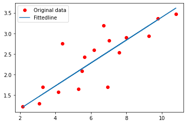
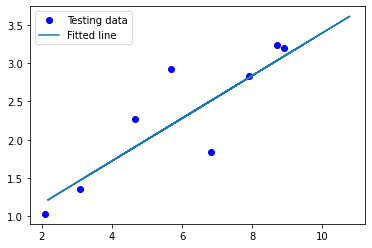

```python
import tensorflow as tf
import tensorflow.compat.v1 as tf

tf.disable_v2_behavior()
import numpy as np
import matplotlib.pyplot as plt
```

    WARNING:tensorflow:From C:\Users\Kulsum\AppData\Roaming\Python\Python38\site-packages\tensorflow\python\compat\v2_compat.py:96: disable_resource_variables (from tensorflow.python.ops.variable_scope) is deprecated and will be removed in a future version.
    Instructions for updating:
    non-resource variables are not supported in the long term
    


```python
learning_rate=0.01
training_epochs=2000
display_step=200
```


```python
train_X=np.asarray([3.3,4.4,5.5,6.71,6.93,4.168,9.779,6.182,7.59,2.167, 
                         7.042,10.791,5.313,7.997,5.654,9.27,3.1]) 
train_y = np.asarray([1.7,2.76,2.09,3.19,1.694,1.573,3.366,2.596,2.53,1.221, 
                         2.827,3.465,1.65,2.904,2.42,2.94,1.3]) 
n_samples = train_X.shape[0]
```


```python
#testdata
test_X= np.asarray([6.83, 4.668, 8.9, 7.91, 5.7, 8.7, 3.1, 2.1]) 
test_y = np.asarray([1.84, 2.273, 3.2, 2.831, 2.92, 3.24, 1.35, 1.03]) 
  
```


```python
#set placeholders for feature and target vectors
```


```python

X=tf.placeholder(tf.float32)
y=tf.placeholder(tf.float32)
```


```python
#set model weight and bias
W=tf.Variable(np.random.randn(),name="weight")
b=tf.Variable(np.random.randn(),name="bias")
#construct linear model
linear_model=W*X+b

```


```python
tf.compat.v1.disable_eager_execution()
#mse
cost=tf.reduce_sum(tf.square(linear_model-y))/(2*n_samples)
#Gradient descent
optimizer=tf.train.GradientDescentOptimizer(learning_rate).minimize(cost)
#initialising the vars
init=tf.global_variables_initializer()
#launch the graph
with tf.compat.v1.Session() as sess:
    sess.run(init)
    for epoch in range(training_epochs):
        sess.run(optimizer,feed_dict={X:train_X,y:train_y})
        #display logs per epoch step
        if (epoch+1) % display_step==0:
            c=sess.run(cost,feed_dict={X:train_X,y:train_y})
            print("Epoch;{0:6} \t Cost:{1:10.4} \t W:{2:6.4} \t b:{3:6.4}".format(epoch+1,c,sess.run(W),sess.run(b)))
    print("Optimization finished")
    training_cost = sess.run(cost, feed_dict={X:train_X, y: train_y}) 
    print("Final training cost:", training_cost, "W:", sess.run(W), "b:",sess.run(b), '\n') 
    #graphic disp
    plt.plot(train_X,train_y,'ro',label='Original data')
    plt.plot(train_X,sess.run(W)*train_X+sess.run(b),label="Fittedline")
    plt.legend()
    plt.show()
    testing_cost = sess.run(tf.reduce_sum(tf.square(linear_model - y)) / (2 * test_X.shape[0]),feed_dict={X: test_X, y: test_y}) 
      
    print("Final testing cost:", testing_cost) 
    print("Absolute mean square loss difference:", abs(training_cost - testing_cost)) 
  
    # Display fitted line on test data 
    plt.plot(test_X, test_y, 'bo', label='Testing data') 
    plt.plot(train_X, sess.run(W) * train_X + sess.run(b), label='Fitted line') 
    plt.legend() 
    plt.show() 
```

    Epoch;   200 	 Cost:    0.1602 	 W:0.4153 	 b:-0.3612
    Epoch;   400 	 Cost:    0.1282 	 W:  0.38 	 b:-0.111
    Epoch;   600 	 Cost:    0.1085 	 W:0.3523 	 b:0.08517
    Epoch;   800 	 Cost:   0.09632 	 W:0.3306 	 b:0.2391
    Epoch;  1000 	 Cost:   0.08886 	 W:0.3136 	 b:0.3598
    Epoch;  1200 	 Cost:   0.08427 	 W:0.3002 	 b:0.4545
    Epoch;  1400 	 Cost:   0.08144 	 W:0.2897 	 b:0.5287
    Epoch;  1600 	 Cost:   0.07971 	 W:0.2815 	 b: 0.587
    Epoch;  1800 	 Cost:   0.07864 	 W:0.2751 	 b:0.6327
    Epoch;  2000 	 Cost:   0.07798 	 W:  0.27 	 b:0.6685
    Optimization finished
    Final training cost: 0.07798006 W: 0.27001655 b: 0.6684839 
    
    





    Final testing cost: 0.07572033
    Absolute mean square loss difference: 0.0022597238
    





```python

```
